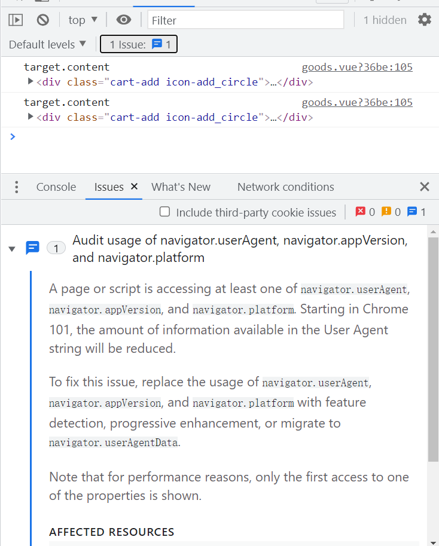
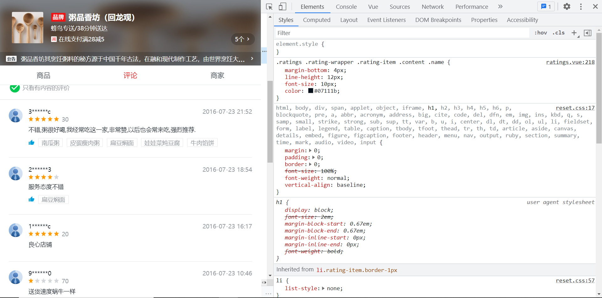
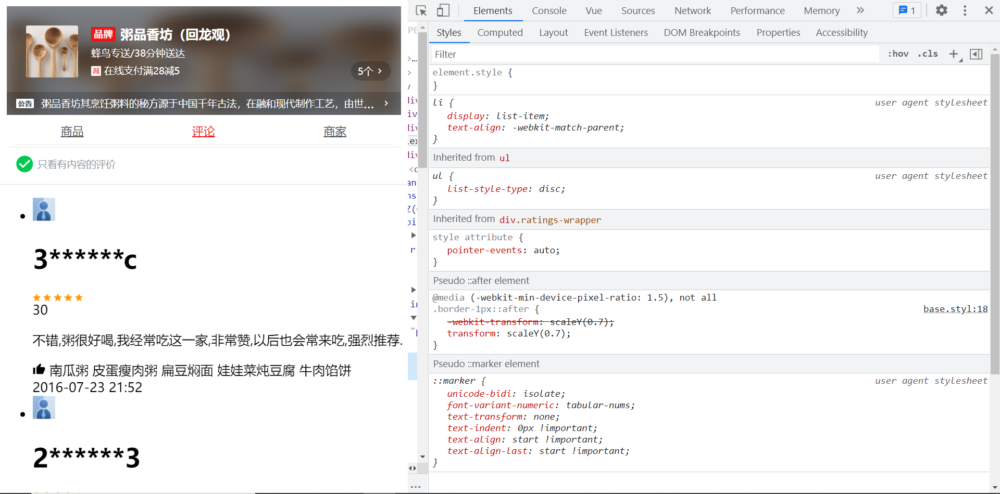
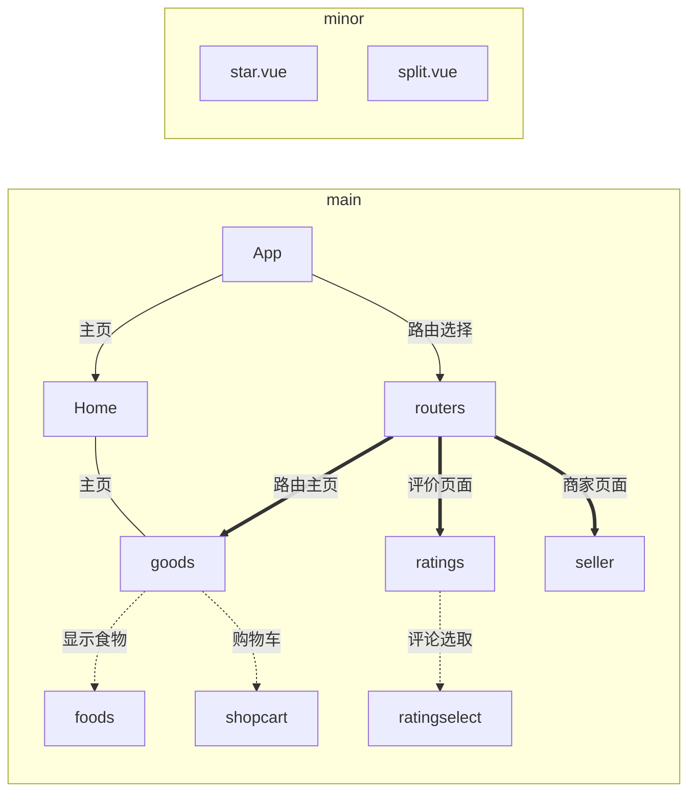

这里是仿照seller案例制作的项目。

目前打算采用直接制作和参考制作这两种混合方式学习。

这里有个做的比较好的项目在线网站：

https://bortala17.github.io/VueDemo/#/goods

### 第一天

这个案例写的很详细，也很规整。具体到评价星号都专门制定了一个组件。

案例可以细分为两大部分

商家展示区和购物区

APP.vue里面只注册了header组件，购物区的三大页面采用路由方式。

案例把页面内容包含的信息与相应的组件放到与组件同名的文件夹下。这一点很适合我这种新手的上手学习。

------

这个案例使用了express搭配axios处理请求以及json解析。我的问题是，express不懂。目前只能考虑是否要使用`vue.config.js`自行创建这个vue默认的文件，还是要简单学习一下express，然后照着案例学习。

其实我挺想使用express的，那就先去学习一下吧！

[链接](https://blog.csdn.net/followly/article/details/120946001?utm_medium=distribute.pc_aggpage_search_result.none-task-blog-2~aggregatepage~first_rank_ecpm_v1~rank_v31_ecpm-8-120946001.pc_agg_new_rank&utm_term=vue%E5%A4%84%E7%90%86json%E6%95%B0%E6%8D%AE&spm=1000.2123.3001.4430)

发现一个比较有用的json服务。

```js
npm install json-server [-g]
```

然后到该json文件下运行

```js
json-server --watch --port 3000 data.json
```

就可以把该文件托管到本地服务器端口号3000的web服务上。这时候的data.json就相当于一个数据库服务器。

我自己测试之后发现。如果json文件含有多个大类对象。它会自动帮你分解成对应的路由。我用的文件有3个大类【seller，goods，ratings】。但是它只给我分成两个路由

同时，访问根地址显示一团乱麻。


遇到了一件难题，这个项目是搭配webpack开发的，我用的是纯vue-cli，所以要重新构建

```vue
vue init webpack second
```

然后使用新构建的second项目，把已经写好的放进去。

主要是，光是想到查一下搜索vue和webpack搭配构建项目这个问题，就使用了我很多时间。原来是可以这样构建项目的。

[链接](https://blog.csdn.net/weixin_45627031/article/details/107846016)

[搜索链接](https://cn.bing.com/search?q=vue%E5%88%9B%E5%BB%BA%E7%9A%84%E9%A1%B9%E7%9B%AE%E5%A6%82%E4%BD%95%E6%89%A7%E8%A1%8Cwebpack&form=CHRDEF&sp=-1&pq=vue%E5%88%9B%E5%BB%BA%E7%9A%84%E9%A1%B9%E7%9B%AE%E5%A6%82%E4%BD%95%E6%89%A7%E8%A1%8Cwebpack&sc=0-19&qs=n&sk=&cvid=DE121DC2791041AE958BD07D53AE8CE0)

明天继续做吧。

### 第二天

没想到安装了eslint模块之后那么恶心，让我呕吐。你TMD动不动就报一大堆错。TMD刚刚定义一个变量都给我标红，连空格的布置都给我严格限制。我玩不起。刚入门都不知道怎么写，你就给我那么多的限制。

然后因为删除的不合法，导致我项目运行不起来，缺少了这部分的模块。我现在又重新init了

目前为止，只能是全部按照他的代码照抄了。他用到的技术很多，而且关联性很强。我目前在学习express，有关路由方面的知识。

以及，关于处理滚动列表的一个模块 `better-scroll`

[链接](http://www.imooc.com/article/18232)

发现这些知识都是两三年前的了，现在不知道是什么样的情况。

实在不行，我大不了买课，最新版的vue3课程有的。

[买课链接](https://coding.imooc.com/class/542.html?mc_marking=f414c339ff709b943c1e6ab872a1bfed&mc_channel=banner)

#### express入门

> 使用 Express 可以调用特定 HTTP 动词（`GET`, `POST`, `SET`等）函数和 URL 模式（“路由”）函数，还可以指定模板（“视图”）引擎的种类、模板文件的位置以及渲染响应所使用的模板。可以使用 Express 中间件来添加对 cookie、会话、用户、获取 `POST`/`GET` 参数，等。可以使用Node 支持的任何类型数据库（Express 本身没有定义任何数据库行为）。

示例代码：

```js
//app.js内容

const express = require('express');		//导入Express模块
const app = express();					//创建一个Express应用

app.get('/', (req, res) => {
  res.send('Hello World!');				//中间三行代码是路由定义
});

app.listen(3000, () => {
  console.log('示例应用正在监听 3000 端口!');	//3000端口上启动服务器
});
```

- 导入和创建模块
- 路由定义：
  - `app.get()` 方法指定了一个回调（callback）函数，该函数在每监听到一个关于站点根目录路径（`'/'`）的 HTTP `GET` 请求时调用。此回调函数以一个请求和一个响应对象作为参数，并直接调用响应的 `send()` 来返回字符串“Hello World!”
- 最后一个代码块在 “3000” 端口上启动服务器，并在控制台打印日志。服务器运行时，可用浏览器访问 `localhost:3000`，看看响应返回了什么。

##### 路由定义

> 路由是一段 Express 代码，它将 HTTP 动词（`GET`、`POST`、`PUT`、`DELETE` 等）、URL 路径/模式和处理函数三者关联起来。

`express.Router`

首先，在 **wiki.js** 模块中创建一个维基路由。代码一开始导入 Express 应用对象，用它取得一个 `Router` 对象，然后用 `get()` 方法向其添加两个具体的路由。模块的最后导出该 `Router` 对象。

```js
// wiki.js - 维基路由模块

const express = require('express');
const router = express.Router();

// 主页路由
router.get('/', (req, res) => {		//.get()方法仅响应HTTP GET请求
  res.send('维基主页');
});

// “关于页面”路由
router.get('/about', (req, res) => {
  res.send('关于此维基');
});

module.exports = router;
```

要在主应用中使用该路由模块，首先应 `require` 它（**wiki.js**），然后对 Express 应用对象调用 `use()`（指定路径‘/wiki’），即可将其添加到中间件处理路径。

```js
const wiki = require('./wiki.js');
// ...
app.use('/wiki', wiki);
```

##### 路由路径

> 路由路径也可以是字符串模式（String Pattern）。可用部分正则表达式语法来定义端点的模式。

##### 路由参数

> 路径参数是命名的 URL 段，用于捕获在 URL 中的位置指定的值。

举例说，一个包含用户和藏书信息的 URL：`http://localhost:3000/users/34/books/8989`，可以这样提取信息（使用 `userId` 和 `bookId` 路径参数）：

```js
app.get('/users/:userId/books/:bookId', (req, res) => {
  // 通过 req.params.userId 访问 userId
  // 通过 req.params.bookId 访问 bookId
  res.send(req.params);
});
```


这样也就解释了项目`'./build/webpack.dev.conf.js'`文件里面的一段代码的作用。

```js
app.use('/api', apiRoutes)
```

这段代码匹配了'/api'为前缀的请求与路由的处理

同样是这个js文件里面，他在DevServer(){}方法里面，添加了before( )方法，里面是对路由处理的配置。根据我对vue的理解，这个before可能是一个原生的方法，在npm run dev 运行时，在服务开启之前，就先执行方法体中的代码。

我仍然不理解，为什么我用` vue  init webpack second `命令初始化的项目，在项目结构中自动创建了`'./build/webpack.dev.conf.js'`等一众express相关的配置文件。除非webpack也使用了express模块。想来也是比较可能的，毕竟node和express搭配比较多。

### 第三天

##### vue.$nextTick

vm.$nextTick( [callback] )  接受一个回调函数

**用法**

将回调延迟到下次 DOM 更新循环之后执行。在修改数据之后立即使用它，然后等待 DOM 更新。它跟全局方法 `Vue.nextTick` 一样，不同的是回调的 `this` 自动绑定到调用它的实例上。

##### vue.nextTick

Vue.nextTick( [callback, context] ) 

**用法**

在下次 DOM 更新循环结束之后执行延迟回调。在修改数据之后立即使用这个方法，获取更新后的 DOM。


##### vue  :class  【Class与Style 绑定】

用于操作元素的class属性和内联style样式。

这样的用法类似于组件开发中 :seller="seller" 用于传递prop

当用于绑定HTML class 时，可以传递一个对象、甚至是数组


##### vm.$emit 

vm.$emit( eventName, […args] )

**用法**

触发当前实例上的事件。附加参数都会传给监听器回调。

**示例**：

```html
//js代码
this.$emit('give-advice', this.possibleAdvice[randomAdviceIndex])
//HTML 代码
<div id="emit-example-argument">
  <magic-eight-ball v-on:give-advice="showAdvice"></magic-eight-ball>
</div>
//js代码
new Vue({
  el: '#emit-example-argument',
  methods: {
    showAdvice: function (advice) {
      alert(advice)
    }
  }
})
```

##### vue.set

Vue.set( target, propertyName/index, value )

**参数列表：**

- target 			{Object | Array }
- propertyName/index 			{ string | number }
- value						{ any }

返回值是设置的值

**用法：**

向响应式对象中添加一个 property，并确保这个新 property 同样是响应式的，且触发视图更新。它必须用于向响应式对象上添加新 property，因为 Vue 无法探测普通的新增 property (比如 `this.myObject.newProperty = 'hi'`)

> 注意对象不能是 Vue 实例，或者 Vue 实例的根数据对象。


现在是2022年1月21日17:34:44，照抄了人家的代码。

现在可以跑起来了，只是格式有问题，style的问题罢了

他用的是styl什么的，我不是很懂。打算就像这样

明天开始新的项目。


### 第四天

忘记了，今天是周六，休息日。。。。。


刚好也有一些遗留下来的问题，解决掉。

主要是抄代码的时候有些地方出了纰漏。


我发现了一个很有意思的小问题，关于图片的懒加载。



这个问题，原项目也存在，想来我暂时用不到学习的。


CSS预处理styl

`lang="stylus" rel="stylesheet/stylus"`

很有意思的技术，我完全是零基础。

现在项目的问题是，我的css样式和他的完全不一样。最大的原因是styl好像根本就没有编译成功，我暂时也找不出问题来。其实可以结项了》》》》》》





### 第五天

昨天贪玩了一些，看漫画看到晚上零点，罪过罪过~~ ~ ~~

今天写完继续看会儿~~ ~~ 



感觉他这里用到的技术都可以理解或者是已经学过的。

比如fliter  https://cn.vuejs.org/v2/guide/filters.html

还有一个知识就是，在组件import axios时，我学到的是axios.get(...)，他这里用的是全局注册axios，这样就不需要在组件里面import，直接使用$axios.get(...)就可以了。

在src/main.js文件里面，他用了这样一行代码：

`Vue.prototype.$axios = axios`

我查到的情况是，这样的写法在vue2.x版本中可以使用，但是在3.x版本中不能再使用了。

对于整个项目使用到的数据，data.json。在'build/webpack.dev.conf.js'文件中使用node自带模块require

require('../data.json') 引入data.json。

然后不知道node是怎么处理的，结果是，用三个变量seller，ratings，goods接住data.json里面的三个"xxx":{}

在 devServe对象里面使用before( )函数。

```js
before(apiRouter) {
      apiRouter.get('/api/seller',function(req,res){
        res.send({
          errno:0,
          data:seller
        })
      }),
      apiRouter.get('/api/goods',function(req,res){
        res.send({
          errno:0,
          data:goods
        })
      }),
      apiRouter.get('/api/ratings',function(req,res){
        res.send({
          errno:0,
          data:ratings
        })
      })
    }
```

在遇到axios请求时，就把相关数据send出去。
